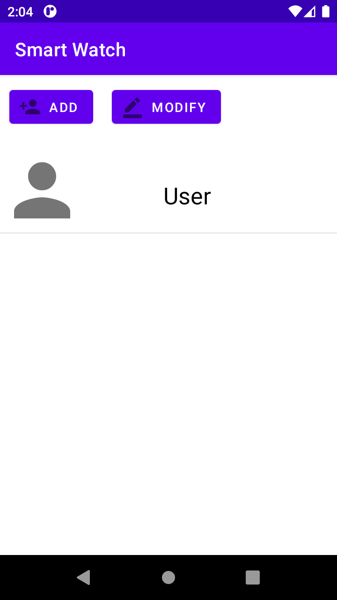
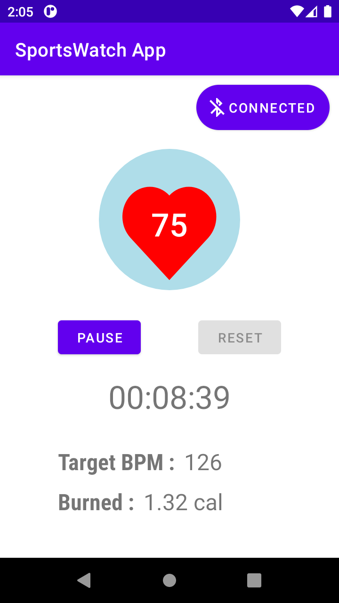
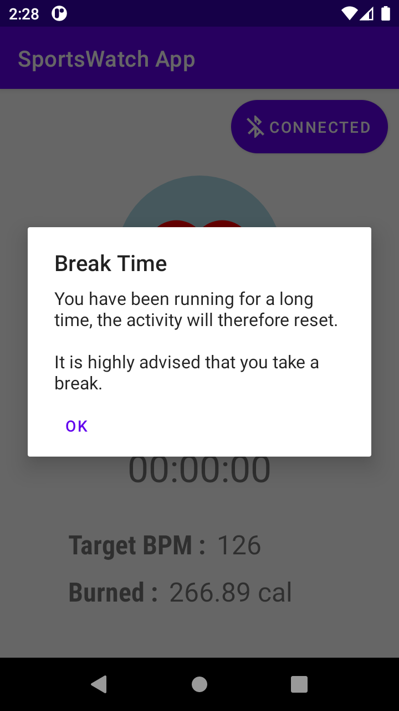
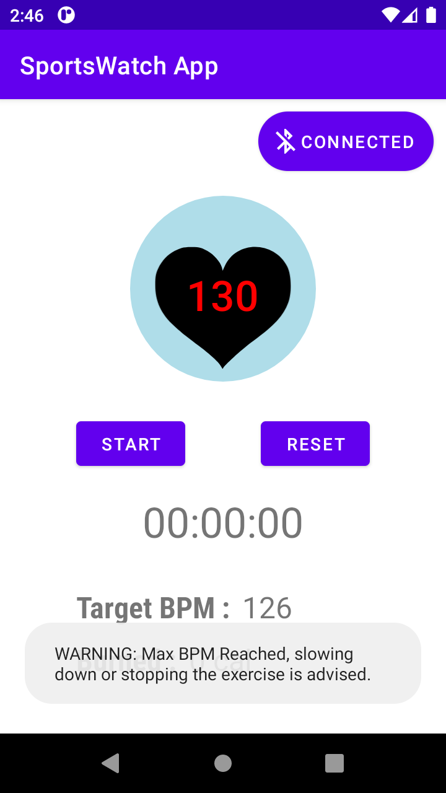

# SportsWatch

## Description
A Kotlin application that receives heart-rate values using Bluetooth and displays them to the user.  
It also calculates the burned calories by tracking the exercise duration and using the average BPM and the profile parameters like age and weight.  
When the user surpasses either the maximum duration or the maximum BPM, a warning message appears.

## Screenshots

	
	
	
	

## Measurement
The measurements are done using an AD-8232 heart-rate sensor connected to an Arduino UNO and the values are sent using a Bluetooth module HC-05. The code is publicly available in the [SportsWatch-Arduino](https://github.com/eljamm/SportsWatch-Arduino) repository.
